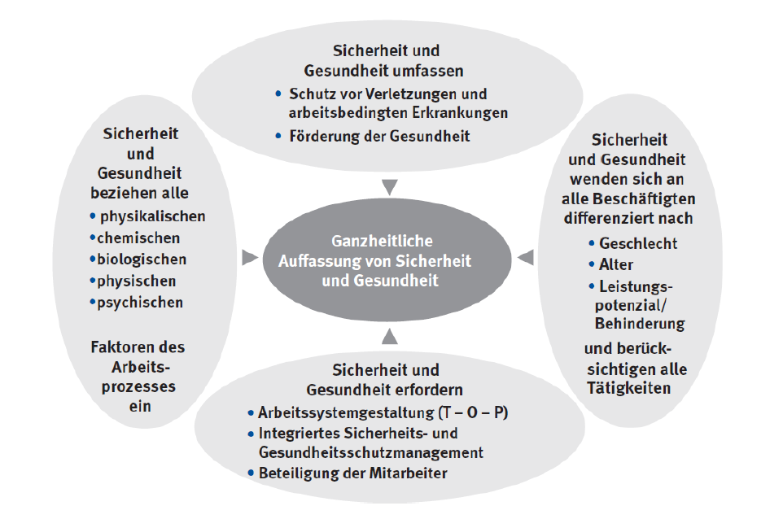
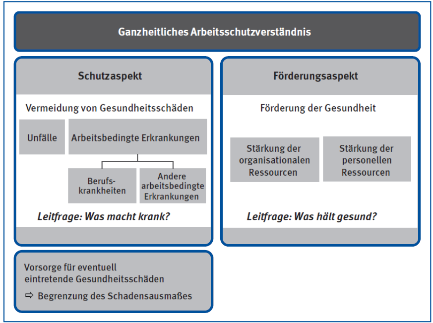
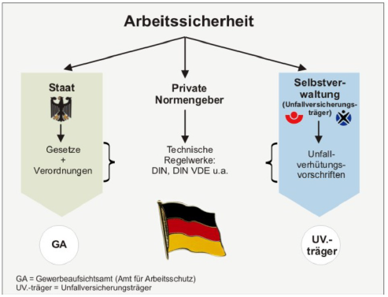
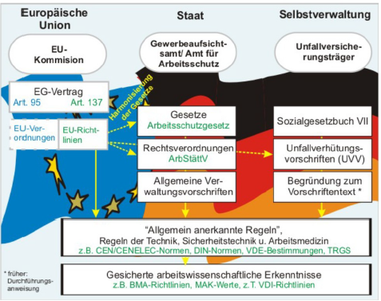
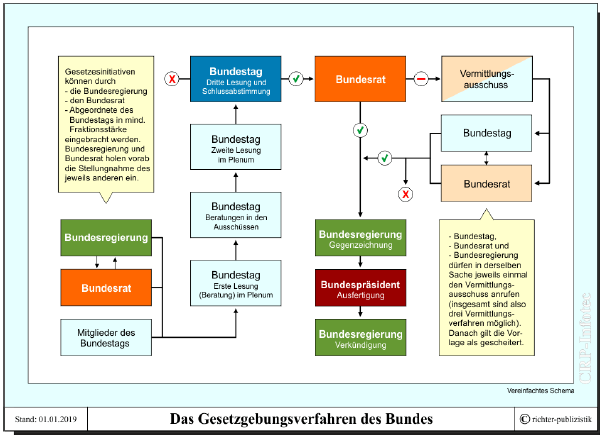
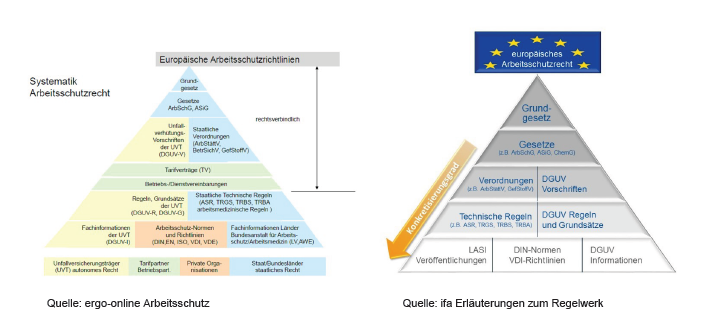
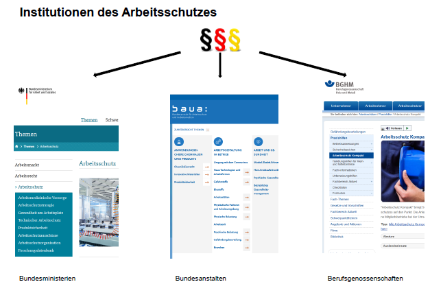
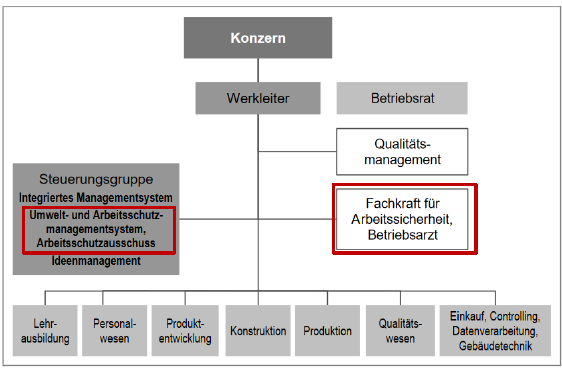
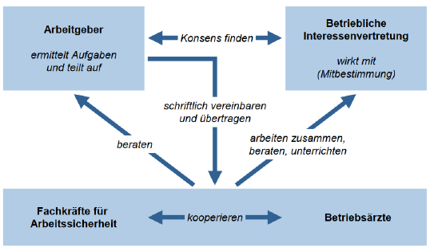

<!--
author:    Hannes Tegelbeckers
email:     hannes.tegelbeckers@ovgu.de
version:   0.1.0
language:  de
narrator:  Deutsch Female
mode:      Presentation
classroom: enable

title:     Sicherheit, Gesundheit, Arbeit – Gruppen-Input IngPäd-Labor
comment:   Orientierungsbeispiel für den Gruppen-Input im Ingenieurpädagogischen Labor, WiSe 2026/27.
-->

# Sicherheit, Gesundheit, Arbeit – Gruppen-Input IngPäd-Labor

                --{{0}}--
Herzlich willkommen zu unserem Gruppen-Input. Wir zeigen, wie Sicherheit und Gesundheit bei der Arbeit organisiert und rechtlich abgesichert sind – und was das für Ihren Laboraufbau bedeutet.

                --{{1}}--
Hier die Eckdaten zu dieser Sitzung.

{{1}}
- **Gruppe:** Gruppe N
- **Termin:** 24.11.2026
- **Seminar:** Fachdidaktik II – Ingenieurpädagogisches Labor (OVGU, Di 09:00–11:00)
- **Umfang:** 20 Min. Input + 10 Min. Aktivierung

## Einstieg: Ein Vorfall im Schullabor

                --{{0}}--
Stellen Sie sich vor: Im Schullabor kippt ein Werkstück von der Werkbank und trifft einen Auszubildenden am Fuß. Im Betrieb hätten Sie für genau so eine Situation klare Abläufe und Verantwortungen gekannt.

                --{{1}}--
Diese Leitfrage begleitet uns heute.

{{1}}
**Leitfrage:** Wer ist im Betrieb – und wer ist in der Schule – dafür zuständig, dass so etwas gar nicht erst passiert?

                --{{2}}--
Aktivieren wir kurz Ihr Vorwissen aus der Praxis.

{{2}}
**Vorwissen aktivieren (Beispiel-Frage an das Plenum):**
Welche Unterweisungen oder Sicherheitsregeln kennen Sie noch aus Ihrer beruflichen Praxis – z. B. aus dem Metallbau oder der Mechatronik?

> [!NOTE]
> Im Betrieb haben Sie Sicherheitsthemen konkret erlebt. Genau diese Erfahrung nutzen wir heute, um die systemische und rechtliche Ebene dahinter zu erschließen.

## Lernziele

                --{{0}}--
Am Ende des Inputs können Sie vier Dinge – die Operatoren nennen, erläutern, ordnen und anwenden leiten die Inhalte.

                --{{1}}--
Hier die vier Lernziele im Überblick.

{{1}}
1. **nennen:** Sie nennen sechs Trends des Wandels der Arbeitswelt und deren Auswirkungen auf den Arbeitsschutz.
2. **erläutern:** Sie erläutern die Definition des Arbeitsschutzes und seine Bestandteile.
3. **ordnen:** Sie ordnen die Rechtsquellen im Arbeitsschutz von der EU-Richtlinie bis zur Norm ihrer Verbindlichkeit nach.
4. **anwenden:** Sie benennen die Akteure des dualen Arbeitsschutzsystems und übertragen die Rechtsquellen auf Ihren eigenen Laboraufbau.

## Wandel der Arbeitswelt: sechs Trends

                --{{0}}--
Bevor wir Recht und Akteure betrachten, ein Blick auf den Kontext: Die Arbeitswelt wandelt sich – und mit ihr die Anforderungen an den Arbeitsschutz.

                --{{1}}--
Die Quelle nennt sechs zentrale Trends.

{{1}}
- **Globalisierung:** Staaten und Wirtschaftsräume rücken zusammen; EU als großer Wirtschaftsraum und Normen- und Regelsetzer; globale Wertschöpfungsketten
- **Technologien:** Innovationsschübe in Mikroelektronik, Digitalisierung und Miniaturisierung; neue Materialien und Stoffe
- **Dienstleistungsgesellschaft:** Anstieg des Dienstleistungsanteils; Einfluss auf Märkte, Produkte und Konsumverhalten
- **Wissensgesellschaft:** Wissen als wesentlicher Produktionsfaktor; Herausforderung an Fähigkeiten und Lernen
- **Demografischer Wandel:** steigender Altersdurchschnitt; kulturelle und geschlechtliche Diversität; Erhalt von Leistungsfähigkeit und Gesundheit
- **Wertewandel:** Verschiebung zwischen Arbeit und Freizeit; lebenslanges Lernen; Vereinbarkeit von Familie und Beruf

                --{{2}}--
Und damit verbunden: veränderte Arbeitsbedingungen.

{{2}}
**Veränderte Arbeitsbedingungen:** Virtualisierung der Arbeitsgegenstände (z. B. virtuelle Zwillinge statt physischer Werkstücke), von IT geprägte Arbeitsmittel, neue Organisations- und Kommunikationsformen, neue Arbeitsverfahren.

> [!NOTE]
> Auch im Schullabor spüren Sie diese Trends: Lernsysteme werden digitaler, Arbeitsabläufe flexibler – und damit verändern sich auch die Gefährdungslagen.

## Wandel der Arbeitswelt: was heißt das für den Arbeitsschutz?

                --{{0}}--
Die Quelle leitet aus dem Wandel drei zentrale Aussagen für das betriebliche Arbeitsschutzhandeln ab.

                --{{1}}--
Diese drei Punkte sind der rote Faden für alles, was folgt.

{{1}}
1. Klassische Handlungsmuster des Arbeitsschutzes und eine Beschränkung auf sicherheitstechnische Disziplinen führen **nicht mehr** zu problemangemessenen Lösungen.
2. Für Arbeitssicherheit sind zunehmend **weniger** Detailkenntnisse einzelner Verfahren, Maschinen und Anlagen von Bedeutung.
3. Arbeitssicherheit muss **problembezogenes Wissen und Methoden aus verschiedenen Fachdisziplinen vernetzen**.

> [!IMPORTANT]
> Arbeitsschutz ist damit kein reines „Fachwissen aus der Berufspraxis“ mehr – er ist ein vernetztes, ganzheitliches Feld. Genau das zeigen die nächsten Folien.

## Arbeitsschutz – eine Definition

                --{{0}}--
Nun zur zentralen Definition, die Sie für Ihren Studiennachweis sicher verwenden können.

                --{{1}}--
Dieser Satz ist der Anker des Inputs.

{{1}}
> „Arbeitsschutz bedeutet die Bewahrung von Leben und Gesundheit im Zusammenhang mit der Arbeit.“
>
> -- Vorjahrespräsentation „Sicherheit und Gesundheit bei der Arbeit“, Kap. 2

                --{{2}}--
Zwei Bereiche sind damit gemeint.

{{2}}
Er umfasst:

- den Schutz vor **arbeitsbedingten Unfall- und Gesundheitsgefahren**,
- den Erhalt gesundheitlicher Ressourcen durch **aktive Gesundheitsförderung** (körperliches, geistiges und soziales Wohlbefinden).

                --{{3}}--
Und zwei Gestaltungsaufgaben ergeben sich daraus.

{{3}}
**Hierzu gehören:**

- eine **menschengerechte Gestaltung** und kontinuierliche Verbesserung der Arbeitsbedingungen,
- **sichere und gesundheitsgerechte Arbeitssysteme**, die den körperlichen und geistigen Leistungsanforderungen der Beschäftigten entsprechen.

                --{{4}}--
Zwei Abbildungen veranschaulichen den ganzheitlichen Ansatz.

{{4}}

> [!TIP]
> Merken Sie sich die Dreiteilung: **Schutz vor Gefahren + Gesundheitsförderung + menschengerechte Arbeitssysteme** – das ist der ganzheitliche Arbeitsschutz.

## Duales Arbeitsschutzsystem in Deutschland

                --{{0}}--
In Deutschland wird Arbeitsschutz nicht von einer Stelle allein organisiert, sondern dual – durch staatliche und selbstverwaltete Akteure.

                --{{1}}--
Die erste Abbildung zeigt die Struktur.

{{1}}

                --{{2}}--
Die zweite Abbildung zeigt die Aufgabenverteilung.

{{2}}

> [!NOTE]
> Die Verhütung von Arbeitsunfällen, Berufskrankheiten und arbeitsbedingten Gesundheitsgefahren ist eine staatliche Aufgabe, die auf dem Arbeitsschutzgesetz (§ 21 ArbSchG) basiert; Bund und Länder sind für die Durchsetzung verantwortlich.

## Die Rolle der Unfallversicherungsträger

                --{{0}}--
Ein zentraler Akteur dieser dualen Struktur sind die Unfallversicherungsträger.

                --{{1}}--
Drei Punkte charakterisieren ihre Rolle.

{{1}}
- **Rechtsstellung:** rechtsfähige Körperschaften des öffentlichen Rechts, handelnd im Rahmen der **Selbstverwaltung**
- **Aufgabenbereich:** Prävention von Arbeitsunfällen und Berufskrankheiten im Sinne des sozialversicherungsrechtlichen Auftrags
- **Grundlage:** Siebtes Buch Sozialgesetzbuch (SGB VII), § 1 Nr. 1, §§ 14 ff. SGB VII i. V. m. §§ 29 ff. SGB IV

> [!TIP]
> Merken Sie sich die Kombination: **Staat = Gesetze und Durchsetzung · Unfallversicherungsträger = Prävention in Selbstverwaltung.**

## EU-Rechtsakte: Richtlinie, Verordnung, Beschluss

                --{{0}}--
Die Rechtsquellen im Arbeitsschutz beginnen in der Europäischen Union – und zwar mit der Richtlinie.

                --{{1}}--
Zuerst die Definition.

{{1}}
**Definition Richtlinie:** Ein Rechtsakt mit allgemeiner Geltung, der EU-Ländern bestimmte **Ziele** vorgibt, den nationalen Stellen aber die Freiheit lässt, **Form und Mittel** zur Zielerreichung selbst zu wählen.

                --{{2}}--
Artikel 288 TFEU formuliert das verbindlich.

{{2}}
> „Eine Richtlinie ist für jedes EU-Land, an das sie gerichtet ist, hinsichtlich des zu erreichenden Ziels verbindlich, überlässt jedoch den innerstaatlichen Stellen die Wahl der Form und der Mittel.“
>
> -- Artikel 288 des Vertrags über die Arbeitsweise der EU (TFEU)

                --{{3}}--
Und so unterscheiden sich die drei Rechtsakte.

{{3}}
| EU-Rechtsakt | Verbindlichkeit |
|---|---|
| **Richtlinie** | Gibt ein Ziel vor, das jedes betroffene EU-Land erreichen muss – ohne Vorgabe der Mittel; erst nach Umsetzung in nationales Recht verbindlich |
| **Verordnung** | Nach Inkrafttreten sofort in allen EU-Ländern verbindlich, gilt unmittelbar ohne nationale Umsetzung |
| **Beschluss** | Gilt nur für die direkt angesprochenen Adressaten (z. B. bestimmte Mitgliedstaaten oder Unternehmen), keine allgemeine Geltung |

> [!NOTE]
> Konkret heißt das: Die EU setzt das Ziel, Deutschland wählt das Mittel – z. B. das Arbeitsschutzgesetz als nationale Umsetzung. Genau diese Unterscheidung ist typische Prüfungsfrage: **Ziel verbindlich, Mittel frei = Richtlinie. Sofort überall geltend = Verordnung.**

## Gesetze und Verordnungen – Rechtsvorschriften

                --{{0}}--
Auf nationaler Ebene gilt: Gesetze und Verordnungen sind zwingend einzuhalten.

                --{{1}}--
Drei Punkte dazu.

{{1}}
- **Gesetze** schreiben **allgemeine Schutzziele** vor, die der Sicherheit und Gesundheit bei der Arbeit dienen.
- **Verbindlichkeit:** Die Befolgung der Anforderungen in Gesetzen und Verordnungen ist **zwingend**.
- **Rechtsverordnungen** werden nicht im förmlichen Gesetzgebungsverfahren vom Bundestag verabschiedet, sondern von der Bundesregierung, einem Bundesminister oder einer Landesregierung erlassen.

                --{{2}}--
Wichtig zu wissen: Wie wird eine Rechtsverordnung legitimiert?

{{2}}
> [!NOTE]
> Die Ermächtigung zum Erlass einer Rechtsverordnung muss in einem Gesetz verankert sein; Zweck und Ausmaß bestimmt das ermächtigende Gesetz. Eine Verordnung darf nicht gegen das Recht der Europäischen Gemeinschaft, die Grundrechte, das Verhältnismäßigkeitsprinzip und den Gleichheitssatz verstoßen.

## Technische Regeln und Normen

                --{{0}}--
Unterhalb der Gesetze und Verordnungen finden Sie Regelwerke und Normen – und hier wird es für die Praxis besonders spannend.

                --{{1}}--
Zunächst die technischen Regeln.

{{1}}
**Technische Regeln:**

- generell **nicht rechtsverbindlich**
- **Konkretisierung** von Gesetzen und Verordnungen als **Orientierungshilfe**
- enthalten **Empfehlungen** und **technische Vorschläge** zur Umsetzung
- **Vermutungswirkung:** Bei Erfüllung der Regel werden die Gesetze bzw. Pflichten erfüllt
- **Regelabweichung** ist unter Einhaltung der Gesetze möglich, um wissenschaftlichen und technischen Fortschritt nicht zu behindern

                --{{2}}--
Dann die Normen.

{{2}}
**Normen:**

- **nicht rechtsverbindlich**
- Konkretisierung der europäischen und deutschen Regelwerke; Orientierungshilfe in konkreten Fällen
- Empfehlungen auf Basis gesicherter wissenschaftlicher Erkenntnisse und Erfahrungen
- Normungsarbeit in Deutschland u. a. beim **Deutschen Institut für Normung (DIN)**; europäisch/international: **EN- bzw. ISO-Normen**

                --{{3}}--
Und ein eigenes technisches Regelwerk hat der VDI.

{{3}}
**VDI-Richtlinien:** Der Verein Deutscher Ingenieure (VDI) hat ein eigenständiges technisches Regelwerk aufgebaut; die darin enthaltenen ca. 2000 VDI-Richtlinien werden von Experten aus Industrie und Wissenschaft erarbeitet und stellen **anerkannte Regeln der Technik** dar.

> [!TIP]
> Die **Vermutungswirkung** ist der wichtigste Hebel: Wer die Regel einhält, gilt im Streitfall als pflichterfüllt. Wer abweicht, muss das aktiv begründen können.

## Gesetzgebungsverfahren und Ebenen im Überblick

                --{{0}}--
Zum Abschluss dieses Blocks: wie Gesetze entstehen und wie sich die Ebenen unterscheiden.

                --{{1}}--
Das Gesetzgebungsverfahren des Bundes im Überblick.

{{1}}

                --{{2}}--
Und der direkte Vergleich der Ebenen.

{{2}}

> [!NOTE]
> Die Pyramide von unten nach oben: **Norm → Regel → Verordnung → Gesetz** – je höher die Ebene, desto stärker die Rechtsverbindlichkeit.

## Übersicht der Rechtsvorschriften im Arbeitsschutz

                --{{0}}--
Diese Übersicht zeigt Ihnen die wichtigsten Rechtsvorschriften, die Sie in der Praxis antreffen werden.

                --{{1}}--
Die Tabelle ist bewusst vollständig – Sie können sie für Ihren Studiennachweis direkt verwenden.

{{1}}
| Rechtsvorschrift | Beschreibung |
|---|---|
| **Arbeitsschutzgesetz** | Grundlegende Regelungen zum Schutz der Sicherheit und Gesundheit der Beschäftigten |
| **Arbeitsstättenverordnung** | Vorschriften zur Gestaltung und Ausstattung von Arbeitsstätten |
| **Betriebssicherheitsverordnung** | Regelungen zur Bereitstellung und Benutzung von Arbeitsmitteln |
| **Gefahrstoffverordnung** | Schutzmaßnahmen beim Umgang mit gefährlichen Stoffen |
| **Verordnung zur arbeitsmedizinischen Vorsorge** | Regelungen zur medizinischen Vorsorge der Beschäftigten |
| **PSA-Benutzungsverordnung** | Vorgaben zur Nutzung der persönlichen Schutzausrüstung |
| **Verordnung zum Schutz vor Lärm und Vibrationen** | Schutz der Beschäftigten vor Lärm- und Vibrationsbelastungen |
| **Verordnung zum Schutz vor künstlicher optischer Strahlung** | Regelungen zum Schutz vor optischer Strahlung am Arbeitsplatz |
| **Lastenhandhabungsverordnung** | Vorschriften zur sicheren Handhabung von Lasten |
| **Biostoffverordnung** | Schutzmaßnahmen im Umgang mit biologischen Arbeitsstoffen |
| **Baustellenverordnung** | Sicherheit und Gesundheitsschutz auf Baustellen |

## Institutionen und die drei Säulen des Arbeitsschutzes

                --{{0}}--
Neben den Rechtsquellen gibt es eine Institutionenlandschaft – und Arbeitsschutz gliedert sich in drei Säulen.

                --{{1}}--
Hier die Institutionen im Überblick.

{{1}}

                --{{2}}--
Und so gliedert sich Arbeitsschutz in Deutschland.

{{2}}
| Unfallverhütung | Gesundheitsschutz | Sozialer Arbeitsschutz |
|---|---|---|
| Allgemeine Arbeitssicherheit | Arbeitsmedizinische Vorsorge | Arbeitszeitschutz |
| Technischer Arbeitsschutz | Gesundheitsfürsorge | Schutz für besondere Gruppen von Beschäftigten |
| Brandschutz | Arbeitsgestaltung | |
| Explosionsschutz | Ergonomie | |
| | Raumgestaltung | |
| | Klima/Licht und Lärmschutz | |

> [!IMPORTANT]
> Im Schullabor treffen Sie vor allem die erste Säule (Unfallverhütung) und Teile der zweiten (Ergonomie, Raumgestaltung) – der soziale Arbeitsschutz wirkt eher im Arbeitszeit- und Organisationsbereich.

## Fallbeispiel: Produktionsbetrieb

                --{{0}}--
Nun üben wir direkt: Ein Produktionsbetrieb führt eine neue Maschine ein – welche Akteure sind beteiligt?

                --{{1}}--
Zuerst der Fall.

{{1}}

                --{{2}}--
Und die Aufgaben der betrieblichen Akteure.

{{2}}

> [!NOTE]
> Die Abbildung zeigt die Aufgaben der betrieblichen Akteure im Überblick. Im Quiz gleich prüfen wir, welche Rolle welche Aufgabe trägt.

## Transfer: Was heißt das für Ihren Laboraufbau?

                --{{0}}--
Jetzt der wichtigste Schritt: Übertragen Sie das Gehörte auf Ihren eigenen Laboraufbau – z. B. ein Pneumatik- oder Elektropneumatik-Lernsystem im Lernfeld einer Mechatroniker-Ausbildung.

                --{{1}}--
Dieses Beispiel zeigt, wie der Transfer konkret aussieht.

{{1}}
**Beispiel – Pneumatik-Lernsystem im Schullabor:**

- **Rechtsquellen:** Das **Arbeitsschutzgesetz** bildet den Rahmen; die **Arbeitsstättenverordnung** regelt den Raum; die **Betriebssicherheitsverordnung** die Lernsysteme als Arbeitsmittel; **Technische Regeln** und **DIN-Normen** konkretisieren die Umsetzung.
- **Akteure:** Im Betrieb wären dies Arbeitgeber, Fachkraft für Arbeitssicherheit und Unfallversicherungsträger. In der Schule übernimmt die **Lehrkraft** eine zentrale Verantwortung für die Unterweisung der Schülerinnen und Schüler.
- **Ihre Aufgabe:** Benennen Sie für Ihren Laboraufbau die relevanten Rechtsquellen und Akteure – und dokumentieren Sie das in Ihrem Studiennachweis.

> [!IMPORTANT]
> Vorsicht beim Übertragen: Das Arbeitsschutzgesetz schützt **Beschäftigte** – in der Schule also die Lehrkräfte. Schülerinnen und Schüler sind keine Beschäftigten; für sie gelten eigene Regeln (Schülerunfallversicherung, Richtlinie zur Sicherheit im Unterricht). Genau das ist Thema des nächsten Gruppen-Inputs „Sicherheit in Schulen“.

## Aktivierung 1: Quiz – Wer berät den Arbeitgeber? (ca. 3 Min.)

                --{{0}}--
Kleine Wissenskontrolle: Welche Rolle berät den Arbeitgeber in allen Fragen des Arbeitsschutzes und ist mitverantwortlich für das Sicherheitsniveau im Betrieb?

                --{{1}}--
Bitte wählen Sie aus dem Fallbeispiel heraus die richtige Ansprechperson.

{{1}}
**Beispiel-Fall:** Ein Produktionsbetrieb berät sich zur Einführung einer neuen Maschine. Wer ist die richtige Ansprechperson?

- [( )] Der Betriebsrat
- [(X)] __Die Fachkraft für Arbeitssicherheit__
- [( )] Der Geschäftsführer
- [( )] Die Belegschaft

> [!TIP]
> Die **Fachkraft für Arbeitssicherheit** ist Betriebsberater nach ASiG (Arbeitssicherheitsgesetz), unterstützt den Arbeitgeber in allen Fragen des Arbeitsschutzes und ist mitverantwortlich für das Sicherheitsniveau im Betrieb.

## Aktivierung 2: Rechtsquellen zuordnen (ca. 4 Min.)

                --{{0}}--
Nun ordnen Sie selbst zu: Welche Rechtsquelle passt zu welcher Beschreibung?

                --{{1}}--
Tippen Sie jeweils den Begriff der passenden Rechtsquelle ein.

{{1}}
1. „Gibt ein Ziel vor, das jedes betroffene EU-Land erreichen muss – ohne Vorgabe der Mittel.“

[[Richtlinie]]

2. „Nach Inkrafttreten sofort in allen EU-Ländern verbindlich – gilt unmittelbar ohne nationale Umsetzung.“

[[Verordnung]]

3. „Schreiben allgemeine Schutzziele vor – die Befolgung ist zwingend.“

[[Gesetz]]

4. „Nicht rechtsverbindlich – aber bei Erfüllung greift die Vermutungswirkung.“

[[Technische Regel]]

> [!NOTE]
> Besprechen Sie kurz im Plenum, welche Zuordnung unsicher war – gerade der Unterschied zwischen Verordnung und technischer Regel fällt vielen schwer.

## Aktivierung 3: Umfrage – Was ist für Ihren Laboraufbau relevant? (ca. 3 Min.)

                --{{0}}--
Abschließend eine kurze Umfrage: Welche Rechtsquelle ist für Ihren konkreten Laboraufbau am relevantesten?

                --{{1}}--
Markieren Sie die für Sie wichtigste Quelle – die Ergebnisse sehen wir live.

{{1}}
Welche Rechtsquelle ist für Ihren Laboraufbau am relevantesten?

- [(1)] Arbeitsschutzgesetz
- [(2)] Arbeitsstättenverordnung
- [(3)] Betriebssicherheitsverordnung
- [(4)] Technische Regeln
- [(5)] DIN-Normen
- [(6)] PSA-Benutzungsverordnung

> [!NOTE]
> Die Ergebnisse zeigen uns live, auf welchen Bereich wir in der Folgediskussion am meisten eingehen sollten.

## Zusammenfassung

                --{{0}}--
Fassen wir die Kernaussagen zusammen.

                --{{1}}--
Fünf Punkte nehmen Sie mit.

{{1}}
1. **Wandel der Arbeitswelt** – Globalisierung, Technologien, Dienstleistungs- und Wissensgesellschaft, Demografie und Wertewandel verändern die Anforderungen an den Arbeitsschutz.
2. **Arbeitsschutz** bedeutet die Bewahrung von Leben und Gesundheit im Zusammenhang mit der Arbeit – Schutz vor Gefahren **und** aktive Gesundheitsförderung.
3. **Duales System:** Staat (Gesetze, Durchsetzung) und Unfallversicherungsträger (Prävention, Selbstverwaltung) arbeiten zusammen.
4. **Rechtsquellen-Pyramide:** EU-Richtlinie → Gesetz → Verordnung → Technische Regel → Norm; die **Vermutungswirkung** der Regeln ist der zentrale Hebel.
5. **Transfer:** Die Systematik der Rechtsquellen hilft auch im Schullabor – aber dort gelten für Lehrkräfte (Beschäftigte) und Schülerinnen und Schüler unterschiedliche Schutzregeln (→ Input „Sicherheit in Schulen“).

## Quellen

                --{{0}}--
Die Inhalte dieser Präsentation basieren auf der Vorjahresquelle und den dort genannten Rechtsquellen.

                --{{1}}--
Die Quellen im APA-7-Format – Jahreszahlen wurden bewusst nicht ergänzt, da die Vorjahresquelle keine nennt.

{{1}}
1. Gruppen-Input „Sicherheit und Gesundheit bei der Arbeit“ (o. J., Vorjahr). Ingenieurpädagogisches Labor, OVGU [unveröffentlichte Studierendenpräsentation].
2. Europäische Union (o. J.). *Richtlinien der Europäischen Union*. EUR-Lex.
3. Bundestag (o. J.). *Arbeitsschutzgesetz (ArbSchG)*, § 21.
4. Bundestag (o. J.). *Siebtes Buch Sozialgesetzbuch (SGB VII)*, § 1 Nr. 1, §§ 14 ff. i. V. m. §§ 29 ff. SGB IV.

> [!NOTE]
> <!-- PRÜFEN: Die Vorjahresquelle enthält keine Jahreszahlen oder Publikationsdaten; bei Zitierung im Studiennachweis bitte die aktuelle Fassung der genannten Gesetze und Verordnungen (ArbSchG, SGB VII, TFEU-Artikel 288) prüfen. -->
> Alle Kernaussagen stammen aus der Vorjahresquelle; neue Paragraphen, Normnummern oder Statistiken wurden **nicht** ergänzt.
