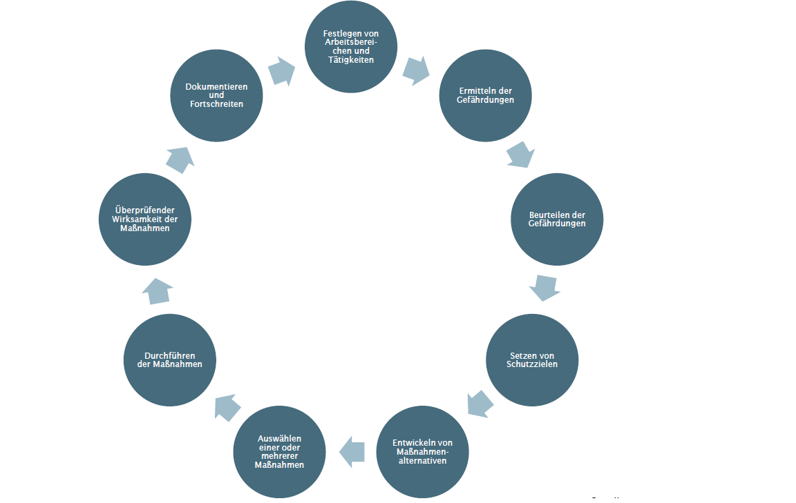
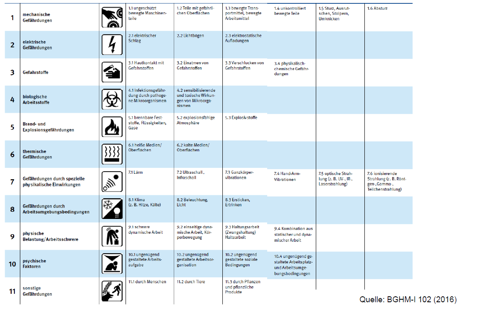
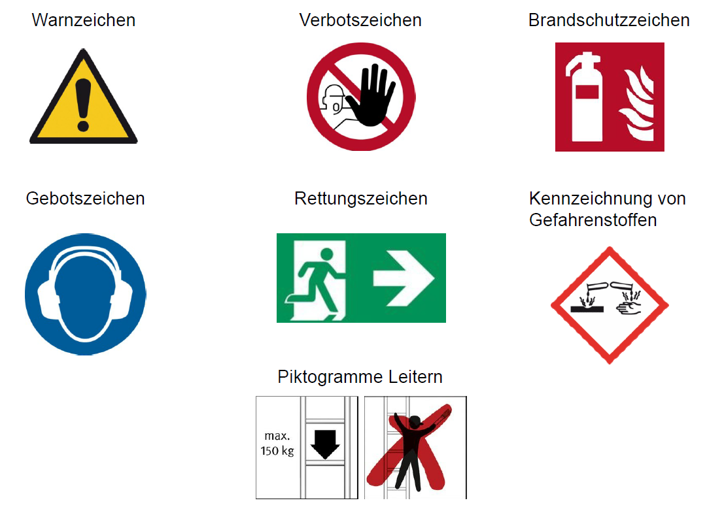

<!--
author:    Hannes Tegelbeckers
email:     hannes.tegelbeckers@ovgu.de
version:   0.1.0
language:  de
narrator:  Deutsch Female
mode:      Presentation
classroom: enable

title:     Gefährdung und Schutzziele – Gruppen-Input IngPäd-Labor
comment:   Orientierungsbeispiel für den Gruppen-Input im Ingenieurpädagogischen Labor, WiSe 2026/27.
-->

# Gefährdung und Schutzziele

                --{{0}}--
Herzlich willkommen zum Gruppen-Input „Gefährdung und Schutzziele". Wir schauen heute, wie im Labor Gefährdungen erkannt, bewertet und vermieden werden – und was das für Ihren eigenen Laboraufbau bedeutet.

**Gruppe N** · 08.12.2026 · Ingenieurpädagogisches Labor, WiSe 2026/27

## Einstieg: Was hätte verhindert werden müssen?

                --{{0}}--
Stellen Sie sich vor: Im Schullabor berührt ein Auszubildender aus Versehen einen spannungsführenden Schaltschrank. Was hätte verhindert werden müssen, dass es dazu kommt?

                --{{1}}--
Diese Leitfrage begleitet uns heute.

{{1}}
**Leitfrage:** Wie erkennen wir Gefährdungen im Labor, bevor sie zu Unfällen werden – und welche Schutzziele und Maßnahmen leiten wir daraus ab?

## Lernziele

                --{{0}}--
Diese vier Lernziele begleiten den Input. Am Ende sollen Sie die Instrumente nennen, das Vorgehen erklären, Risiken beurteilen und alles auf Ihren Laboraufbau übertragen können.

                --{{1}}--
Die vier Lernziele.

{{1}}
1. **Nennen** Sie die geforderten Instrumente des Arbeitsschutzes und die 11 Gefährdungsgruppen.
2. **Erläutern** Sie das Vorgehen der Gefährdungsbeurteilung nach der Empfehlung der BGHM.
3. **Beurteilen** Sie Risiken und leiten Sie Schutzziele sowie Maßnahmen ab.
4. **Wenden** Sie das Vorgehen auf Ihren eigenen Laboraufbau **an**.

## Instrumente des Arbeitsschutzes

                --{{0}}--
Der Arbeitsschutz im Labor stützt sich auf geforderte Instrumente – und Sie können zusätzlich eigene Formate entwickeln.

                --{{1}}--
Zuerst die geforderten Instrumente, die in jedem Betrieb und in jeder Schule Pflicht sind.

{{1}}
**Geforderte Instrumente:**

- Gefährdungsbeurteilung
- Betriebsanweisung
- Unterweisung
- Ausbildungsnachweis

                --{{2}}--
Daneben gibt es Eigenkreationen – kreative Formate, die über die Pflicht hinausgehen.

{{2}}
**Eigenkreationen (Beispiele aus der Quelle):**

- Sicherheitskurzgespräche, Arbeits- und Memoblätter
- Projekte (auch mit der Berufsschule), Workshops und Diskussionsrunden
- Portfolios, Lernkonferenzen
- Prämierungen, Einbinden von Kampagnen, selbstgesteuertes Lernen

## Rechtsvorschriften und Institutionen

                --{{0}}--
Für den Arbeitsschutz im Labor gelten mehrere Gesetze und Verordnungen. Wichtig ist, dass Sie die für Ihren Bereich relevanten kennen und wissen, wo Sie Hilfe bekommen.

                --{{1}}--
Hier eine Auswahl der wichtigsten Rechtsvorschriften.

{{1}}
**Wichtige Rechtsvorschriften (Auswahl):**

- Arbeitsschutzgesetz
- Arbeitsstättenverordnung
- Betriebssicherheitsverordnung
- Gefahrstoffverordnung
- Verordnung zur arbeitsmedizinischen Vorsorge
- PSA-Benutzungsverordnung
- Verordnungen zu Lärm und Vibrationen, künstlicher optischer Strahlung, Lastenhandhabung, Biostoffen, Baustellen

<!-- PRÜFEN: Die Quelle nennt Jahreszahlen (ArbStättV 2004, GefStoffV 2010, BetrSichV 2015) – vor dem Vortrag prüfen, ob neuere Fassungen gelten. -->

                --{{2}}--
Und hier die Stellen, die Ihnen Dokumente und Hilfen bereitstellen.

{{2}}
**Zuständige Institutionen und Hilfen:**

- Bundesanstalt für Arbeitsschutz und Arbeitsmedizin (BAuA)
- Berufsgenossenschaften: BGHM, BG ETEM, BG BAU, BG RCI
- Informationsplattform „Sichere Schulen"

> Alle Angaben nach: BMAS, „Was ist Arbeitsschutz?".

## Gefährdungsbeurteilung nach der Empfehlung der BGHM

                --{{0}}--
Die BGHM empfiehlt ein systematisches Vorgehen zum Beurteilen von Gefährdungen und Belastungen. Das ist das Herzstück unserer heutigen Stunde.

                --{{1}}--
Die Empfehlung zeigt das Vorgehen im Überblick.

{{1}}

> Empfehlung der BGHM zum Beurteilen von Gefährdungen und Belastungen.
>
> -- BGHM (2016), BGHM-I 102

<!-- PRÜFEN: Prüfen, ob eine neuere Fassung der Empfehlung BGHM-I 102 vorliegt. -->

## Schritt 1–2: Arbeitsbereiche festlegen, Gefährdungen ermitteln

                --{{0}}--
Zuerst grenzen wir den Untersuchungsbereich sauber ein – inklusive der Personengruppen, die besondere Aufmerksamkeit brauchen.

                --{{1}}--
Schritt 1: Arbeitsbereiche und Tätigkeiten festlegen.

{{1}}
**Schritt 1 – Arbeitsbereiche und Tätigkeiten festlegen:**

- Untersuchungsbereich sorgfältig festlegen (Organigramm, Arbeitsplatz- oder Maschinennummern)
- Alle Tätigkeiten der Bereiche differenzieren und listen
- Personengruppen berücksichtigen: Jugendliche und Neulinge, Frauen, werdende und stillende Mütter, leistungsgeminderte und ältere Beschäftigte, Personen ohne ausreichende Deutschkenntnisse, Leiharbeit

                --{{2}}--
Schritt 2: Gefährdungen ermitteln – die Nationale Arbeitsschutzkonferenz unterscheidet elf Gefährdungsgruppen.

{{2}}
**Schritt 2 – 11 Gefährdungsgruppen:**

1. mechanische Gefährdungen
2. elektrische Gefährdungen
3. Gefahrstoffe
4. biologische Gefährdung
5. Brand- und Explosionsgefährdungen
6. thermische Gefährdungen
7. spezielle physikalische Einwirkungen
8. Arbeitsumgebungsbedingungen
9. physische Belastung / Arbeitsschwere
10. psychische Faktoren
11. sonstige Gefährdungen

                --{{3}}--
Die Gruppen lassen sich weiter unterteilen – die Grafik zeigt die Unterteilung.

{{3}}

> Alle Gefährdungen zusammenstellen – sie sind zum Teil sehr standortspezifisch!

## Schritt 3: Gefährdungen beurteilen

                --{{0}}--
Jetzt bewerten wir: Wie hoch ist das Risiko? Hohes Risiko bedeutet Gefahr, niedriges Risiko wird oft mit Sicherheit gleichgesetzt – und beides ist relativ.

                --{{1}}--
Beurteilt wird anhand rechtlicher Vorgaben und technischer Regelwerke.

{{1}}
**Bewertung nach:**

- Vorgaben aus Gesetzen, Verordnungen und technischen Regelwerken
- z. B. Expositionsgrenzwerte für Vibrationen

                --{{2}}--
Und diese Faktoren fließen in die Risikoabschätzung ein.

{{2}}
**Bei der Risikoabschätzung berücksichtigen:**

- Häufigkeit
- Dauer
- Intensität
- physische und psychische Faktoren

                --{{3}}--
Wichtig: Das höchste akzeptable Risiko legen die Unternehmer unter Einhaltung der rechtlichen Vorgaben fest.

{{3}}
> Das „höchste akzeptable Risiko" legen die Unternehmer unter Einhaltung der rechtlichen Vorgaben fest.

## Schritt 4: Schutzziele setzen

                --{{0}}--
Ein klares Schutzziel ist entscheidend: Mit klaren Zielen ist ein optimales Preis-Leistungs-Verhältnis erreichbar. Danach planen wir die Umsetzung – Budget, Zeitrahmen, Ordnungsmittel.

                --{{1}}--
Hier vier Beispiele für Schutzziele aus der Quelle.

{{1}}
**Beispiele für Schutzziele:**

- Verhinderung der Kontaktmöglichkeit zwischen Bohrspindeln und Arbeitskleidung, während die Maschine läuft
- Verhinderung des Einklemmens von Fingern
- Verhinderung ständiger Bückbewegungen
- Verhinderung von Gefährdungen durch Transportarbeiten während des Bedienens der Maschine

## Schritt 5–6: Maßnahmen entwickeln und auswählen

                --{{0}}--
Nun suchen wir Lösungen – gern kreativ – und wählen dann aus, was wirklich passt.

                --{{1}}--
Schritt 5: Maßnahmenalternativen entwickeln, zum Beispiel mit Kreativitätstechniken.

{{1}}
**Schritt 5 – Maßnahmenalternativen entwickeln:**

- Brainstorming, Methode 635 / Brainwriting, Brainwalking
- Collective-Notebook, Mind Mapping, Kartentechnik / Metaplan-Technik
- Mentale Provokation, morphologischer Kasten
- Delphi-Methode: mehrstufige schriftliche Befragung von Experten aus Betrieb und Unfallversicherungsträgern

                --{{2}}--
Schritt 6: Aus den Alternativen eine oder mehrere Maßnahmen auswählen.

{{2}}
**Schritt 6 – Maßnahmen auswählen:**

| Kriterien | Zu berücksichtigen |
|---|---|
| Praktikabilität | Anschaffungskosten |
| Wirksamkeit | Laufende Kosten |
| Akzeptanz | Vermeiden neuer Gefährdungen |
| Platzbedarf | Erfüllungsgrad der Vorschriften |
| Betriebliche Gegebenheiten | |

## Schritt 7–10: Umsetzen, prüfen, dokumentieren, fortschreiben

                --{{0}}--
Eine Maßnahme nützt nur, wenn sie umgesetzt, geprüft und dokumentiert wird – und die Beurteilung weiterlebt.

                --{{1}}--
Schritt 7: Maßnahmen durchführen – mit klarem Umsetzungsmanagement.

{{1}}
- **Schritt 7 – Durchführen:** Wer ist für die Durchführung verantwortlich? Bis wann soll sie abgeschlossen sein?

                --{{2}}--
Schritt 8: Wirksamkeit der Maßnahmen prüfen.

{{2}}
- **Schritt 8 – Wirksamkeit prüfen:** Wirkt die Maßnahme? Ja → auch aus rechtlicher Sicht prüfen und pflegen. Nein → Schritte 5 und 6 wiederholen.

                --{{3}}--
Schritt 9: Dokumentieren.

{{3}}
- **Schritt 9 – Dokumentieren:** Gefährdungen, Beurteilung, getroffene Maßnahmen und die Wirksamkeitskontrolle müssen aus der Dokumentation hervorgehen.

                --{{4}}--
Und Schritt 10: Die Gefährdungsbeurteilung fortgeschrieben – sie bleibt ein lebendes Dokument.

{{4}}
- **Schritt 10 – Fortschreiben:** Die Gefährdungsbeurteilung wird fortgeschrieben.

## Sicherheitszeichen und Kennzeichnung

                --{{0}}--
Sicherheitszeichen sind die visuelle Sprache des Arbeitsschutzes. Im Labor sollten alle Zeichenarten bekannt sein.

                --{{1}}--
Das sind die Zeichenarten.

{{1}}
- Warnzeichen
- Verbotszeichen
- Gebotszeichen
- Rettungszeichen
- Brandschutzzeichen
- Kennzeichnung von Gefahrenstoffen
- Piktogramme (z. B. Leitern)

                --{{2}}--
Und so sehen die Zeichen aus.

{{2}}

## Betriebsanweisung und Produktsicherheit

                --{{0}}--
Die Betriebsanweisung baut auf den Angaben des Herstellers auf – Typenschilder, Bedienungsanleitungen, Prüfsiegel.

                --{{1}}--
Das sind die Basisangaben für die Betriebsanweisung.

{{1}}
**Basis für die Betriebsanweisung (Herstellerangaben):**

- Produktinformationen, Bedienungsanleitungen, Gebrauchshinweise
- Typenschilder, Wartung und Entsorgung
- Prüfsiegel und Sicherheitszertifikate: GS, TÜV, CE

                --{{2}}--
Produkte müssen sicher sein: Dafür sorgt auf nationaler Ebene das Produktsicherheitsgesetz.

{{2}}
**Produktsicherheit:** Basis bilden EU-Richtlinien zur Produktsicherheit, national verankert im Produktsicherheitsgesetz (ProdSG) – das zentrale Gesetz für den Vertrieb von Non-Food-Produkten.

<!-- PRÜFEN: Die in der Quelle genannten EU-Richtlinien (z. B. Maschinenrichtlinie 2006/42/EG) wurden teils durch neuere EU-Rechtsakte ersetzt – vor dem Vortrag aktualisieren. -->

                --{{3}}--
Und der Unterschied zwischen CE und GS – das ist eine häufige Prüfungsfrage.

{{3}}
| | CE | GS |
|---|---|---|
| Wer vergibt? | Hersteller (Selbstvergabe) | Unabhängige Stelle (Fremdvergabe) |
| Pflicht? | Nur, wenn die EU-Richtlinie es vorschreibt | Freiwillig |
| Wirkung | Europäischer „Reisepass" für Produkte | Werbewirksame Absetzung in der Sicherheit |

## Gefahren des elektrischen Stroms

                --{{0}}--
Elektrischer Strom ist eine schwer erkennbare Gefahr: Er ist nicht zu hören, zu riechen oder zu sehen. Und der menschliche Körper ist vergleichsweise ein guter Stromleiter.

                --{{1}}--
Diese Parameter bestimmen, wie Strom auf den Menschen wirkt.

{{1}}
**Parameter für die Wirkung:** Stromstärke $I$ [A], Spannung $U$ [V], Widerstand $R$ [Ω], Frequenz $f$ [1/s], Einwirkdauer $t$ [ms], Gleichstrom (DC) oder Wechselstrom (AC).

                --{{2}}--
Strom wirkt thermisch, chemisch und auf Nerven und Muskeln.

{{2}}
**Wirkungen auf den Menschen:**

- Thermische Wirkung (Verbrennungen, Strommarken an Ein- und Austrittsstellen)
- Chemische / elektrolytische Wirkung
- Nerven- und muskelreizende Wirkung (Verkrampfung, „Klebenbleiben")
- Licht- und magnetische Wirkung

                --{{3}}--
Und das Ausmaß der Schädigung hängt von vier Faktoren ab.

{{3}}
**Das Ausmaß der Schädigung hängt ab von:** Stromstärke, Dauer des Stromflusses, Kontaktflächengröße, Durchströmungsweg im Körper.

> Folgewirkung: Eine Schreckreaktion durch Muskelzucken kann z. B. einen Sturz von erhöhten Arbeitsplätzen auslösen.

## Fünf Sicherheitsregeln und persönliche Schutzausrüstung

                --{{0}}--
Vor Arbeiten an elektrischen Anlagen gilt: den spannungsfreien Zustand herstellen und sicherstellen. Die fünf Sicherheitsregeln sind dafür das Handwerkszeug.

                --{{1}}--
Die fünf Sicherheitsregeln im Überblick.

{{1}}

> An unter Spannung stehenden aktiven Teilen darf im Regelfall nicht gearbeitet werden.

                --{{2}}--
Zusätzlich schützt die persönliche Schutzausrüstung – sie ergibt sich aus der Gefährdungsbeurteilung.

{{2}}
**PSA – Beispiele (aus der Quelle):**

- Isolierender Schutzanzug, isolierende Handschuhe
- Isolierender Schutzhelm (Kennzeichnung 440 V), Gesichtsschutz
- Sicherheitsschuhe – keine Stahleinlage in der Sohle
- Isoliertes Werkzeug, zweipolige Spannungsprüfer

> Ob Schutz- oder Arbeitskleidung nötig ist, ergibt sich in der Regel aus der Gefährdungsbeurteilung.

## Prüfung elektrischer Betriebsmittel

                --{{0}}--
Elektrische Betriebsmittel müssen geprüft werden – vor der ersten Inbetriebnahme, nach Änderungen und in bestimmten Zeitabständen. Prüffristen sind keine Wunschfristen!

                --{{1}}--
Die Pflicht zur Prüfung ergibt sich aus der Betriebssicherheitsverordnung und der DGUV Vorschrift 3.

{{1}}
**Pflicht zur Prüfung:** Betriebssicherheitsverordnung § 10 und DGUV Vorschrift 3 (BGV A3) § 5 – durch eine Elektrofachkraft oder unter deren Leitung und Aufsicht.

<!-- PRÜFEN: § 10 BetrSichV stammt aus der alten Fassung der Quelle; in der BetrSichV 2015 steht die Prüfung von Arbeitsmitteln in § 14. Paragraph vor dem Vortrag abgleichen. -->

                --{{2}}--
Und so läuft eine Prüfung ab.

{{2}}
**Die Prüfung umfasst:**

1. Besichtigen (Sichtprüfung – immer zuerst)
2. Messen (Grenzwerte, typische Werte, Normen)
3. Erproben (Funktionsprüfung)
4. Dokumentation (Ergebnisse, Kennzeichnung)

> Ohne eine Gefährdungsbeurteilung zur Prüftätigkeit darf nicht geprüft werden!

## Elektromobilität: Hochvolt in Fahrzeugen

                --{{0}}--
Wer im Lernfeld mit E-Mobilen arbeitet, muss Hochvolt kennen: Die Bordnetze von Elektroautos liegen bei etwa 400 V – deutlich über der klassischen 12-V-Autobatterie.

                --{{1}}--
Das ist die internationale Definition von Hochvolt.

{{1}}
**Hochvolt (international vereinbarte Vorschrift, ECE 100):**

- Gleichstrom: > 60 V bis 1500 V
- Wechselstrom (Effektivwert): > 30 V bis 1000 V

                --{{2}}--
Bei Arbeiten an HV-Systemen gilt eine klare Reihenfolge der Maßnahmen.

{{2}}
**Maßnahmen bei Arbeiten an HV-Systemen – in dieser Reihenfolge:**

1. Technische Maßnahmen (Vorrang): z. B. Isolierung, feste Abdeckungen
2. Organisatorische Maßnahmen: z. B. Wartezeiten zum Abbau der Spannung
3. Persönliche Maßnahmen: z. B. PSA (Isolierhandschuhe, Helm mit Visier), Unterweisung

> Höhere Bordnetzspannungen und erhöhte elektrische Energie durch das HV-System ergeben ein bisher nicht vorhandenes Niveau der elektrischen Gefährdung.
>
> -- BGI/GUV-I 8686

<!-- PRÜFEN: BGI/GUV-I 8686 ist eine alte Schriftennummer; aktuelle DGUV-Bezeichnung vor dem Vortrag nachschlagen. -->

## Transfer: Was heißt das für Ihren Laboraufbau?

                --{{0}}--
Jetzt wird es konkret: Wir übertragen die Schritte der BGHM auf ein durchgehendes Beispiel – ein Pneumatik- bzw. Elektropneumatik-Lernsystem im Lernfeld einer Mechatroniker-Ausbildung.

                --{{1}}--
So sieht die Übertragung Schritt für Schritt aus.

{{1}}
**Beispiel – Gefährdungsbeurteilung für eine Pneumatik-Station:**

| Schritt | Übertragung auf das Beispiel |
|---|---|
| 1 Arbeitsbereich festlegen | Pneumatik-Station: Schaltkasten, Ventile, Zylinder, Druckschalter |
| 2 Gefährdungen ermitteln | Elektrische Gefährdungen (24-V-Steuerkreis, 230-V-Netzteil), mechanische Gefährdungen (Quetschen an Zylindern, umherschlagende Druckluftschläuche), Arbeitsumgebung (Lärm) |
| 3 Beurteilen | Häufigkeit, Dauer, Intensität abschätzen; z. B. Griff in den Zylinderhub beim Umbau unter Druck |
| 4 Schutzziel setzen | Kein Eingreifen in den Bewegungsbereich der Zylinder, während Druck anliegt |
| 5–6 Maßnahmen | Druck erst nach Freigabe, Not-Aus am Tisch, Schutzbrille, Betriebsanweisung, Unterweisung |
| 7–10 Umsetzen | Verantwortliche und Termin festlegen, Wirksamkeit prüfen, dokumentieren, fortschreiben |

> Beispiel: Durchgehendes Übungsbeispiel für die Übertragung – keine Angabe aus der Vorjahresquelle.

## Aktivierung (ca. 5 min): Quiz

                --{{0}}--
Kurze Aktivierung im Plenum: zwei Quizfragen zum Gehörten.

**1) Welches der folgenden ist KEIN gefordertes Instrument des Arbeitsschutzes?**

- [( )] Gefährdungsbeurteilung
- [( )] Betriebsanweisung
- [(X)] Prämierung
- [( )] Unterweisung

                --{{1}}--
Zweite Frage – Mehrfachauswahl: Welche Gefährdungsgruppen kommen bei einem Elektropneumatik-Lernsystem in Frage?

{{1}}
**2) Übung – Welche Gefährdungsgruppen können bei einem Elektropneumatik-Lernsystem (Steuerkreis, Ventile, Zylinder) vorkommen? (Mehrfachauswahl)**

- [[X]] Elektrische Gefährdungen
- [[X]] Mechanische Gefährdungen
- [[ ]] Biologische Gefährdung
- [[ ]] Psychische Faktoren

## Aktivierung (ca. 5 min): Risiko einschätzen

                --{{0}}--
Und jetzt Ihre Einschätzung: Wie wahrscheinlich ist ein Zwischenfall, wenn in Ihrem Laboraufbau jemand ohne Unterweisung an einen Schalter greift?

**Umfrage – Ihre Einschätzung:**

- [(1)] Sehr wahrscheinlich
- [(2)] Wahrscheinlich
- [(3)] Unwahrscheinlich
- [(4)] Sehr unwahrscheinlich

                --{{1}}--
Kurze Runde im Plenum: Was müsste passieren, damit Ihre Antwort „sehr unwahrscheinlich" bleibt?

{{1}}
> Kurze Runde im Plenum: Was müsste passieren, damit Ihre Antwort „sehr unwahrscheinlich" bleibt? (z. B. Unterweisung, Schutzeinrichtungen, Betriebsanweisung)

## Zusammenfassung

                --{{0}}--
Fünf Kernaussagen nehmen Sie mit – sie sind zugleich die Struktur für Ihre eigene Gefährdungsbeurteilung.

1. **Geforderte Instrumente:** Gefährdungsbeurteilung, Betriebsanweisung, Unterweisung, Ausbildungsnachweis.
2. **Systematisches Vorgehen:** Arbeitsbereich festlegen, Gefährdungen ermitteln (11 Gruppen), beurteilen, Schutzziele setzen, Maßnahmen entwickeln und auswählen, umsetzen, prüfen, dokumentieren, fortschreiben.
3. **Klare Schutzziele** machen Maßnahmen wirksam und wirtschaftlich.
4. **Elektrischer Strom** ist eine schwer erkennbare Gefahr – Fünf Sicherheitsregeln und PSA schützen die Personen.
5. **Transfer:** Die Gefährdungsbeurteilung schreiben Sie für Ihren eigenen Laboraufbau.

## Quellen

                --{{0}}--
Alle Inhalte stammen aus der Vorjahrespräsentation und den dort genannten Quellen.

1. Bundesministerium für Arbeit und Soziales (n. d.). *Was ist Arbeitsschutz?* https://www.bmas.de/DE/Arbeit/Arbeitsschutz/arbeitsschutz.html
2. BGHM (2016). *BGHM-I 102: Empfehlung zum Beurteilen von Gefährdungen und Belastungen.* https://www.bghm.de/
3. BGHM (n. d.). *Gefährdungen und Schutzziele – Musterbetrieb Maschinenbau (Arbeitsblatt-Auszug).* https://www.bghm.de/arbeitsschuetzer/gefaehrdungsbeurteilungen/maschinenbau/musterbetrieb-maschinenbau/
4. DGUV (n. d.). *DGUV Vorschrift 3 (BGV A3), § 5 – Prüfung elektrischer Anlagen und Betriebsmittel* (Auszug in der Vorjahresquelle).
5. IHK Regensburg (n. d.). *Produktsicherheitsgesetz (ProdSG)* (Zusammenfassung in der Vorjahresquelle).
6. DGUV (n. d.). *BGI/GUV-I 8686 – Gefährdungsbeurteilung von E-Mobilen* (in der Vorjahresquelle zitiert).
