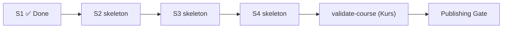

<!--
author: Hannes Tegelbeckers
language: de
-->

# Fachdidaktik II – Ingenieurpädagogisches Labor: Gruppen-Inputs

## Dashboard

<article class="dashboard">

_Generated from the project sections below. Do not edit manually._

### Current State

__Current step:__ Session 1 gebaut (Material + Validierung + Persona-Review)

__Course validation:__ noch nicht (Kursmodus)

__Sessions complete:__ 1 / 4

__Last updated:__ 2026-02-14 (Autopilot: `:build-session 1 input` abgeschlossen)

### Next Commands

1. [▶ Build session 2](agent:teaching/build-session?number=2&type=input) `:build-session 2 input` — Material für „Sicherheit, Gesundheit, Arbeit" fehlt
2. [👁 Show material](agent:teaching/preview?file=materials/01-lehren-und-lernen/README.md) `:preview materials/01-lehren-und-lernen/README.md` — Session 1 im DevServer ansehen
3. [🧑‍🎓 Review as Lena](agent:learner/review-as-persona?name=Lena&number=1&type=input) `:review-as-persona Lena 1 input` — interaktiver Follow-up als Lena

### Agents

🎓 __Teaching__ — nächste Sessions bauen und validieren · [▶ Build session 2](agent:teaching/build-session?number=2&type=input) `:build-session 2 input`

🎨 __Artist__ — keine Bildgenerierung in diesem Projekt (Bilder aus der Quelle) · [🎨 Switch](agent:artist/switch) `:agent artist`

🧑‍🎓 __Learner__ — Persona-Reviews und Follow-up-Dialoge · [🧑‍🎓 Review as Lena](agent:learner/review-as-persona?name=Lena&number=1&type=input) `:review-as-persona Lena 1 input`

🛠️ __Development__ — erst nach Kurs-Validierung (Publishing Gate) · [🛠️ Switch](agent:development/switch) `:agent development`

### Quality State

- Session 1: Validation PASS · Persona OK
- Sessions 2–4: noch nicht gebaut
- Kursmodus-Validierung: offen (Publishing Gate: no-go)

### Workflow Map

### Session Progress

<!-- data-type="none" -->
| # | Title | Status | Next step |
|---|-------|--------|-----------|
| 1 | Lehren und Lernen im Labor | ✅ done | [👁 Preview](agent:teaching/preview?file=materials/01-lehren-und-lernen/README.md) `:preview materials/01-lehren-und-lernen/README.md` |
| 2 | Sicherheit, Gesundheit, Arbeit | 🟡 skeleton | [▶ Build](agent:teaching/build-session?number=2&type=input) `:build-session 2 input` |
| 3 | Sicherheit in Schulen | 🟡 skeleton | [▶ Build](agent:teaching/build-session?number=3&type=input) `:build-session 3 input` |
| 4 | Gefährdung und Schutzziele | 🟡 skeleton | [▶ Build](agent:teaching/build-session?number=4&type=input) `:build-session 4 input` |

### Open Blockers

- Keine. (Offene PRÜFEN-Punkte zu APA-Angaben in Session 1 — siehe `agent_report.md`.)

### Quick Links

- [↻ Validate session 1](agent:teaching/validate-course?number=1&type=input) `:validate-course 1 input`
- [🔍 Validate syntax](agent:teaching/validate-syntax?number=1&type=input) `:validate-syntax 1 input`
- [↻ Update dashboard](agent:teaching/update-dashboard) `:update-dashboard`

</article>

## Course Context

__Course Type:__ seminar

__Terminology:__ Gruppen-Input (session), Seminar (course), Studierende (learners)

__Course Profile:__ Vier LiaScript-Präsentationen als Orientierungsbeispiele für die Gruppen-Inputs im Seminar „Ingenieurpädagogisches Labor“. Grundlage sind die Studierendenpräsentationen des Vorjahres (`inputs/quelle_T1.md`, `quelle_T2.md`, `quelle_T4.md`) bzw. Stichworte (`inputs/quelle_T3.md`).

__File Structure:__ multi-file

__Conventions & Standards:__ siehe `inputs/rahmen.md` (verbindlich).

__LiaScript conventions:__ Deutsch; `mode: Presentation`; `classroom: enable`; Sprechernotizen `--{{0}}--` auf jeder Folie; keine externen Templates.

__Additional Notes:__ Jeder Lauf erstellt genau einen Gruppen-Input. Die übrigen Seminarsitzungen existieren außerhalb dieses Projekts.

## Outline

__Title:__ Fachdidaktik II – Ingenieurpädagogisches Labor (WiSe 2026/27)

__Target Audience:__ Studierende Lehramt an berufsbildenden Schulen, gewerblich-technische Fachrichtungen, ca. 10–20 Personen.

__Time Commitment:__ je Gruppen-Input 20 min Input + 10 min Aktivierung.

__Abstract:__ Studierende binden einen domänenspezifischen Laboraufbau didaktisch in eine Lernsituation ein – sicher, rechtlich begründet und methodisch durchdacht.

__Learning Objectives:__
1. Den didaktischen Wert von Laboraufbauten und technischen Lehr-/Lernsystemen erschließen.
2. Grundlagen des Lehrens und Lernens im Labor anwenden.
3. Arbeits- und Gesundheitsschutz sowie rechtliche Grundlagen einer sicheren Lernumgebung benennen.
4. Gefährdungen beurteilen und Schutzmaßnahmen ableiten.

## Didactics

__Didactic Concept:__ Handlungsorientierung und Constructive Alignment; jede Präsentation endet mit dem Transfer auf den eigenen Laboraufbau. Details: `inputs/rahmen.md`.

__Professor Persona:__ Hochschullehrer der Ingenieurpädagogik, sachlich, beispielreich aus Metall-, Elektro- und Mechatroniklaboren.

__Teaching Style:__ kurzer, strukturierter Input mit schrittweiser Animation, danach Aktivierung des Plenums (Quiz, Zuordnung, Umfrage).

__Course Type:__ seminar

__Didactic Framework:__ Constructive Alignment

__Default Session Method:__ gagne

__Session Types:__
  1. __Gruppen-Input__ (slug: `input`) — Präsentation im LiaScript-Folienmodus, 20 min Input + 10 min Aktivierung. Erforderlich: Einstieg mit Leitfrage, Lernziele, Input, Transfer auf den Laboraufbau, Aktivierung, Zusammenfassung, Quellen, Sprechernotizen.

__Difficulty Level:__ Lehramtsstudium, fachliches Grundwissen der eigenen Fachrichtung vorhanden, Arbeitsschutzrecht neu.

## Visual Identity

_Nicht benötigt (keine Bildgenerierung; vorhandene Bilder der Vorjahresquelle werden übernommen)._

## Templates

_Keine externen Templates._

## Agenda

| # | Titel | Type | Method | Dauer | Status |
|---|---|---|---|---|---|
| 1 | Lehren und Lernen im Labor | input | gagne | 30 min | ✅ |
| 2 | Sicherheit, Gesundheit, Arbeit | input | gagne | 30 min | ⬜ |
| 3 | Sicherheit in Schulen | input | gagne | 30 min | ⬜ |
| 4 | Gefährdung und Schutzziele | input | gagne | 30 min | ⬜ |

## Sessions

| # | Titel | Type | Skeleton | Material | Validation |
|---|---|---|---|---|---|
| 1 | Lehren und Lernen im Labor | input | ✅ | ✅ | ✅ |
| 2 | Sicherheit, Gesundheit, Arbeit | input | ✅ | ⬜ | ⬜ |
| 3 | Sicherheit in Schulen | input | ✅ | ⬜ | ⬜ |
| 4 | Gefährdung und Schutzziele | input | ✅ | ⬜ | ⬜ |

### 1. Lehren und Lernen im Labor

**Type:** input · **Method:** gagne · **Termin:** 03.11.2026 · **Ausgabe:** `materials/01-lehren-und-lernen/README.md` · **Status:** ✅ Done

**Summary:** Was technische Lernsysteme und Laboraufbauten leisten (Vor- und Nachteile), wie sie methodisch eingebettet werden (Experiment, Prüfverfahren, didaktische Reduktion) und welche Rolle Medien und der didaktische Raum spielen.

**Content:** Lernsysteme Mechatronik/Automatisierung · Vor- und Nachteile technischer Lernsysteme · Methoden zur Einbettung · experimentelle Methoden und Erkenntnisziele · technisches Experiment als didaktisches Mittel · Prüfverfahren · didaktische Reduktion · Medienspektrum, Veranschaulichung, Medienmerkmale · Angebots-Nutzungs-Modell · didaktischer Raum. Quelle: `inputs/quelle_T1.md`.

**Activities:** Einstiegsumfrage zu eigenen Laborerfahrungen · Zuordnung Experimentarten ↔ Erkenntnisziele · Transfer: Welche Experimentart passt zu Ihrem Laboraufbau?

#### Validation Report

<section>

__Date:__ 2026-02-14
__Material:__ `materials/01-lehren-und-lernen/README.md`
__Result:__ PASS
__Mode:__ session

##### Content
- ✅ Alle Lernziele der Agenda/Outline sind im Material adressiert (nennen: Vor-/Nachteile; erläutern: technisches Experiment + Erkenntnisziele; beurteilen: Prüfverfahren; anwenden: Reduktion/Medien im Transfer)
- ✅ Keine Platzhalter- oder inhaltsleeren Abschnitte; alle Kernaussagen, Definitionen und Tabellen der Quelle sind enthalten (Kürzungen: keine – siehe `agent_report.md`)
- ✅ Referenzen vorhanden (Pahl 2007, Schweder 2013, Vorjahrespräsentation); `reference-checker` nicht verfügbar (offline, Skill nicht installiert) – Quellencheck übersprungen, PRÜFEN-Hinweise im Material gesetzt
- ✅ Dauer: ca. 10 Min. Sprechertext (130 Wpm) + ca. 15 Min. Aktivitäten (Umfrage, Transfer-Dialog, 5 Quiz-/Zuordnungsaufgaben) ≈ 25 Min. → innerhalb von 70–150 % der 30 Min. (advisory: OK)

##### Type Consistency
- Session Type: `input` — Erforderlich: Einstieg mit Leitfrage, Lernziele, Input, Transfer auf den Laboraufbau, Aktivierung, Zusammenfassung, Quellen, Sprechernotizen
- ✅ Alle Pflichtelemente vorhanden (Leitfrage Folie „Einstieg“, Lernziele mit Operatoren, Input in 3 Teilen, Transfer-Folie mit Elektropneumatik-Beispiel, Aktivierung mit Quiz + Zuordnung, Zusammenfassung, Quellen APA-7-Hinweis, `--{{0}}--` auf jeder Folie)
- ✅ Session Method `gagne`: Aufmerksamkeits-Hook (Leitfrage), Vorwissen aktiviert (Einstiegsumfrage), Praxis mit Feedback (Quiz mit `[[?]]`-Erklärungen)

##### Persona & Style
- ✅ Ton sachlich, beispielreich, Sie-Form; Terminologie „Gruppen-Input“/„Studierende“ konsistent
- ⚠️ Coauthor-Rolle fehlt unter `## Agents` → Fallback auf Professor Persona/Teaching Style (in `## Didactics`) – Coauthor-Rolle sollte synchronisiert werden

##### LiaScript Syntax
- ✅ Metadata-Header vollständig (author, email, version, language, narrator, mode: Presentation, classroom: enable)
- ✅ Heading-Struktur: 1× `#` Titel + 3× `#` Kapiteltrenner (≤4), alle Folien als `##`, keine nackten `####`
- ✅ Animationen: Nummerung setzt nach jeder Folie auf 0 zurück; jedes `{{n}}` hat passendes `--{{n}}--`; `--{{0}}--` auf jeder Folie
- ✅ Quiz-Syntax: Single Choice `[( )]`/`[(X)]`, Optionen nicht eingerückt; Umfrage `[(1)]`–`[(3)]`
- ✅ Bilder: nur Dateinamen aus der Quelle, ohne Pfad, mit Alt-Text; ASCII-Diagramm mit `ascii`-Tag
- ✅ Keine ungeschlossenen Codeblöcke/HTML-Container; kein unerlaubtes HTML
- ✅ Keine erfundenen Paragraphen/Normnummern/Statistiken; englische Folientitel der Quelle auf Deutsch

##### Recommended Actions
1. Vollständige APA-7-Angaben für Pahl (2007) und Schweder (2013) ergänzen (PRÜFEN-Hinweise im Material)
2. Coauthor-Rolle unter `## Agents` → `### Coauthor` anlegen (optional, für spätere Läufe)

</section>

#### Persona Reviews

<section>

##### 🧑‍🎓 Lena

__Date:__ 2026-02-14
__Persona:__ 🧑‍🎓 Lena — Industriemechanikerin, Lehramt BBS Metalltechnik, Rechtsthemen trocken, will konkret wissen, was sie im Schullabor tun muss.
__Material:__ `materials/01-lehren-und-lernen/README.md`
__Result:__ OK

###### Overall Impression
„Endlich mal ein Input, der nicht bei Paragraphen anfängt. Die Folien sind knapp, die Sprechertexte erklären, was ich mir sonst selbst zusammenreimen müsste, und am Ende weiß ich konkret, was ich mit meinem Laboraufbau anfangen soll. Die Quizfragen waren fair – ich hätte sie fast alle beantworten können, ohne groß nachzudenken."

###### Dimension Findings

**a) Verständlichkeit / Sprachniveau**
Sätze sind kurz, Fachbegriffe werden erklärt (z. B. „konditional bedeutet: Bedingung und Bedingtes"). Verdict: OK

**b) Schwierigkeitsgrad / Überforderung**
Viele Begriffe (Medienspektrum, Codierungsarten, Angebots-Nutzungs-Modell), aber die Animationen dosieren die Inhalte und die Tabellen sind übersichtlich. Verdict: OK

**c) Relevanz / Motivation**
Hohe Relevanz: Transfer-Folie mit Elektropneumatik-Beispiel und konkreten Übertragungsfragen. Verdict: OK

**d) Zugänglichkeit**
Bilder mit Alt-Text, ASCII-Diagramm statt Mermaid, Quiz-Feedback direkt nach jeder Frage. Verdict: OK

**e) Formatpräferenz**
Guter Mix aus Folientext, Bildern, Tabellen und Quiz – passt zu jemandem, der im Betrieb viel mit Anleitungen und Checklisten arbeitet. Verdict: Good fit

**f) Vorwissen / fehlende Grundlagen**
- „Psychomotorik/Berufsmotorik" — ✅ likely known (Ausbildung)
- „Angebots-Nutzungs-Modell" — ✅ wird erklärt
- „Kognitive Transferleistungen" — ⚠️ assumed, aber im Kontext verständlich
- „Cognitive flexibility", „Spiegelneuronen" — ⚠️ assumed, aber nur in der Tabelle, nicht zentral

###### Priority Issues
Keine blockierenden Punkte. (Kleiner Wunschkandidat: Die Tabelle „Interaktionsformen" könnte um ein konkretes Labor-Beispiel pro Zeile ergänzt werden – nicht blockierend.)

###### What Worked Well
- Sprechertexte auf jeder Folie – man merkt, dass jemand den Vortrag eingeübt hat
- Transfer-Folie mit durchgehendem Beispiel und offener Diskussionsfrage
- Quiz mit Erklärungen nach jeder Antwort – kein „Raten ohne Feedback"

</section>

### 2. Sicherheit, Gesundheit, Arbeit

**Type:** input · **Method:** gagne · **Termin:** 24.11.2026 · **Ausgabe:** `materials/02-sicherheit-gesundheit-arbeit/README.md`

**Summary:** Wandel der Arbeitswelt, Definition des Arbeitsschutzes, Akteure und Organisation (duales Arbeitsschutzsystem), Rechtsquellen von der EU-Richtlinie bis zur DGUV-Regel, betriebliche Akteure.

**Content:** Quelle: `inputs/quelle_T2.md` (alle Kapitel 1–3.5 inkl. Fallbeispiel Produktionsbetrieb).

**Activities:** Rechtsquellen-Pyramide ordnen · Fallbeispiel: Welcher betriebliche Akteur ist zuständig? · Transfer: Welche Rechtsquellen gelten für Ihren Laboraufbau?

### 3. Sicherheit in Schulen

**Type:** input · **Method:** gagne · **Termin:** 01.12.2026 · **Ausgabe:** `materials/03-sicherheit-in-schulen/README.md`

**Summary:** Übertragung des Arbeitsschutzes auf die Schule: Schutz von Lehrkräften und Schülerinnen/Schülern, Verantwortliche, Regelwerke (RiSU, DGUV, GefStoffV), Pflichten im Labor- und Werkstattunterricht, Sicherheit als Unterrichtsinhalt.

**Content:** Quelle: `inputs/quelle_T3.md` (Stichworte; einzige zulässige Faktenbasis, PRÜFEN-Hinweise übernehmen).

**Activities:** Fallvignette Unfall im Schullabor – wer ist versichert, wer verantwortlich? · Checkliste Laborunterricht · Transfer: Sicherheitsunterweisung für den eigenen Laboraufbau skizzieren.

### 4. Gefährdung und Schutzziele

**Type:** input · **Method:** gagne · **Termin:** 08.12.2026 · **Ausgabe:** `materials/04-gefaehrdung-und-schutzziele/README.md`

**Summary:** Instrumente des Arbeitsschutzes, Gefährdungsbeurteilung in sieben Schritten (BGHM), Risikobeurteilung, Schutzziele und Maßnahmenhierarchie, Sicherheitskennzeichnung, Betriebsanweisung, Produktsicherheit (CE, GS), Gefahren des elektrischen Stroms.

**Content:** Quelle: `inputs/quelle_T4.md` (sehr umfangreich – auf 20 min reduzieren; Kürzungen im agent_report.md begründen).

**Activities:** Gefährdungsgruppen zuordnen · Risiko einschätzen (Wahrscheinlichkeit × Schwere) · Transfer: Gefährdungsbeurteilung für den eigenen Laboraufbau beginnen.

## Agents

### Learner Personas

#### Persona: Lena (Lehramt BBS Metalltechnik)

Lena, 24, Industriemechanikerin, Lehramt BBS Metalltechnik. Kennt Unterweisungen aus dem Betrieb, findet Rechtsthemen trocken; will konkret wissen, was sie im Schullabor tun muss. _Abgeleitet aus der Zielgruppenbeschreibung, keine reale Person._

## Validation

_Noch nicht ausgeführt._

## Notes Backup

_Entscheidungen der Autopilot-Läufe werden hier protokolliert._

### Autopilot-Lauf `:build-session 1 input` (2026-02-14)

- **Frage:** Quelle T1 enthält nur Kurzangaben zu Pahl (2007) und Schweder (2013) ohne vollständige APA-Daten. — **Entscheidung:** Quellen im Material mit Kurzangabe + `<!-- PRÜFEN: … -->`-Hinweis versehen, keine Daten erfunden. — **Begründung:** `inputs/rahmen.md` verbietet erfundene Quellen/Angaben; PRÜFEN-Hinweis ist die vorgeschriebene Alternative.
- **Frage:** `rahmen.md` verlangt „mindestens ein Quiz und eine Zuordnungs- oder Umfrageaufgabe" in der Aktivierung; die Quiz-Syntax der Quelle (`[[?]]` nach der Optionsliste) weicht vom Rahmensyntax ab. — **Entscheidung:** `[[?]]`-Erklärungen nach jeder Quizfrage beibehalten (Quelle), Optionen nicht eingerücken (Rahmen). — **Begründung:** Rahmen ist für Format verbindlich, Quelle für Inhalt; beide lassen sich kombinieren.
- **Frage:** Quelle enthält eine Quiz-Folie „Slide 1: Introduction" (englisch, Montessori-Ablenker). — **Entscheidung:** Quizfrage in den Einstieg als Leitfrage-Kontext auf Deutsch umformuliert und als Umfrage zu den eigenen Laborerfahrungen umgesetzt; Montessori-Option weggelassen. — **Begründung:** Rahmen verlangt deutsche Sprache und einen Einstieg mit Leitfrage; die Quizfrage der Quelle war didaktisch schwach (eine offensichtlich richtige Antwort) und wird durch die Umfrage + die inhaltlich stärkeren Quizfragen im Aktivierungsblock ersetzt. Kürzung dokumentiert in `agent_report.md`.
- **Frage:** `promote-session` verlangt die Coauthor-Rolle aus `## Agents` → `### Coauthor`, die nicht existiert. — **Entscheidung:** Fallback auf Professor Persona + Teaching Style aus `## Didactics`. — **Begründung:** Fallback ist in `promote-session.md` Schritt 4 explizit vorgesehen.
- **Frage:** `:build-session` Schritt 1b/3 (create-image/generate-image) — **Entscheidung:** übersprungen. — **Begründung:** Autopilot-Regel 3 verbietet Bildgenerierung; Bilder ausschließlich aus der Quelle mit Originaldateinamen.
- **Frage:** Persona-Review: keine blockierenden Punkte gefunden. — **Entscheidung:** 1 Runde, keine Iteration 2. — **Begründung:** Loop-Bedingung „keine blockierenden Punkte" nach Runde 1 erfüllt.
